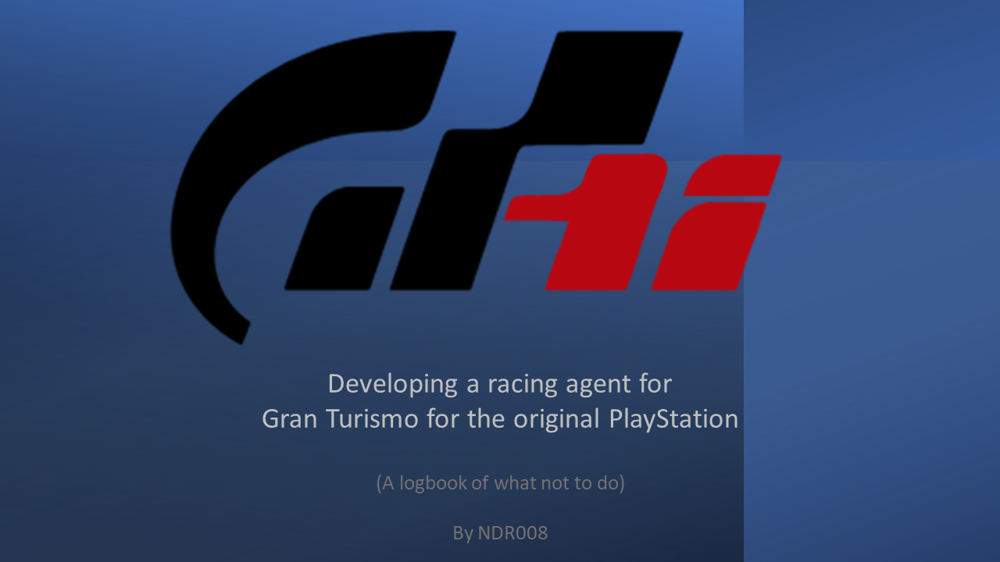

# Gran Turismo Racing AI Agent for the PSX via Reinforcement Learning

## Background 
There are 3 main motivational background factors to this project.

### 1. Failed Interview 
Unknown to my work colleauges (guess they might if they come across this page, but most of them are too non-geeky to look for it I guess), soon after starting my MSc in Computer Science and completing my HarvardX CS50 course, I applied for a racing simulation engineer role at Polyphony Digital (Japan). I felt qualified for the position due to the fact, that I met the requirements for:
* Automotive industrial experience (I have 10 years)
* Racing interest (personal experience)
* Automotive degree (I have a BEng in Motorsports Engineering)
* Driving licence (at the time I had a Japanese Gold driving licence and EU driving licence)
* Coding experience preferred

Come interview day - most of my interview required live C++ coding (something I claimed to only have basic surface level experience) and a VERY cliche text-book physics question (the kind you only remember 3 months after you finish your degree).  

I was grateful to have been interviewed, but rather frustrated at the way I was rejected...  
This left me spending the rest of my duration of the MSc in Computer Science thinking of how to get back at them... so I kept targetting at doing something Gran Turismo related (and in all honesty, something  AI-related was on my mind).  
Few months before starting final project, in early 2022, Sony/Polyphony Digital [published](https://www.nature.com/articles/s41586-021-04357-7) their on Sophy, their AI agent that out-raced most humans on Gran Turismo sport.

### 2. Childhood Love 
Since I can ever remember - there were 2 things I loved... cars and racing games. The history and connection I have to cars will take forever to describe, growing up in a disfunctional family, refuge in my father's car, which would one day become my own, is probably one main catalyst to that love. Growing up, I kept dreaming of making a realistic racing game, until PD released Gran Turismo on the original PlayStation. Having witnessed the magnicence of Gran Turismo, I realised (assumed) that to do something better, one would need to specialise on understanding the physics, more than the coding. That is what lead me to focus on studying towards engineering - not for the sake of becoming an engineer, but rather for the sake of making better racing games.  

Ironically, because I loved cars and in particular - Toyota, I could not miss the chance to work at DENSO - a Toyota group company that is considered the be the [real founder of the Toyota Production System and their success](https://acuresearchbank.acu.edu.au/download/f0f019d090032cf83ced86219d1a845e9027b3d8ba17890e9b58c253d3330394/250205/Anderson_2003_The_enigma_of_Toyotas_competitive_advantage.pdf) by Evelyn Anderson. This journey lead me to working in 3 regions - UK, Germany and Japan, and also lead me to meet my wife, with whome I gratefuly have the most amazing family I could have wished for.  

Nevertheless, that itch, for scartching that second half of my childhood dream that was forever put into an irreversable direction due to the PlayStation and Polyphony's Gran Turismo, still needed to be scratched somehow.

### 3. Falling in Love with AI
While starting my MSc, my goals were to learn strong programming skills in particular C/C++. Unfortunately my course did not include barely anything on C and nothing on C++. CS50x and my attempts at PSX homebrew had to fill that gap. However, what I did discover during my degree was how cool AI can be. Most people think of AI as something that is substituting humans but yet will never be as good as humans.   

I however choose to view and recognise AI differently. When I think of AI - I do not consider the full spectrum, and in doing so, I exclude things like model/rules based solutions (like modelling the rules of TicTacToe). Rather I only consider supervised and unsupervised learning that is reliant on Neural Networks. Why? Becuase I trully believe they are reflections of how humans work. [Joscha Bach's work](http://bach.ai/) further reinforced this opinion of mine - that neural network, that abstract semi-black-box AI is the best framework we have at modelling human intelligence. Teaching a Neural Network to categorise dogs and cats is very similar how we teach a child to distinguish an apple from an orange.  

Thus ultimately, I believe, that teaching an agent to drive and perform at Gran Turismo, is essentially the same at creating a human who has the congitive disposition at becoming a successful racing driver with sufficient training. The only difference is that a computer based machine, will execute perfectly the actions it wishes to take, unlike a human, who's intent and action may different slightly resulting in what is probably based described as "human-error" or the imperfection that makes us human. 

## Legal Comment 
Based on the FAQ on euipo.europa.eu, it is assumed that this education research (as part of my MSc in Computer Science and wider AI research) allows for limited use of the copyrighted (but referenced) material
> ...extracts from copyrighted works are allowed under specific exceptions insofar as the unlicensed user references the name of the author and the source of the work and uses them in the context of a review or discussion of the work, or uses them for non-commercial purposes in teaching or research activities, within the limits justified by these purposes, and in a way that this use does not cause prejudice to the commercial use of the protected work, which the law establishes as the exclusive domain of the copyright holder. 

Furthermore, any efforts of reverse engineering of any original work that is mentioned are done from owned material (software and hardware). More complete and succeesful attempts of some of this methodology was employed by Connectix for their PS1 bios. The conclusion of [their lawsuit](https://en.wikipedia.org/wiki/Sony_Computer_Entertainment,_Inc._v._Connectix_Corp.), and that of [Sega v. Accolade](https://en.wikipedia.org/wiki/Sega_Enterprises,_Ltd._v._Accolade,_Inc.) seems to indicate that this project here follows and is impacted by the same doctrine.

_Disclaimer: None of the above justification has been written in consultation with a legal professional, and I do not claim to be qualified in legal matters of this nature._

